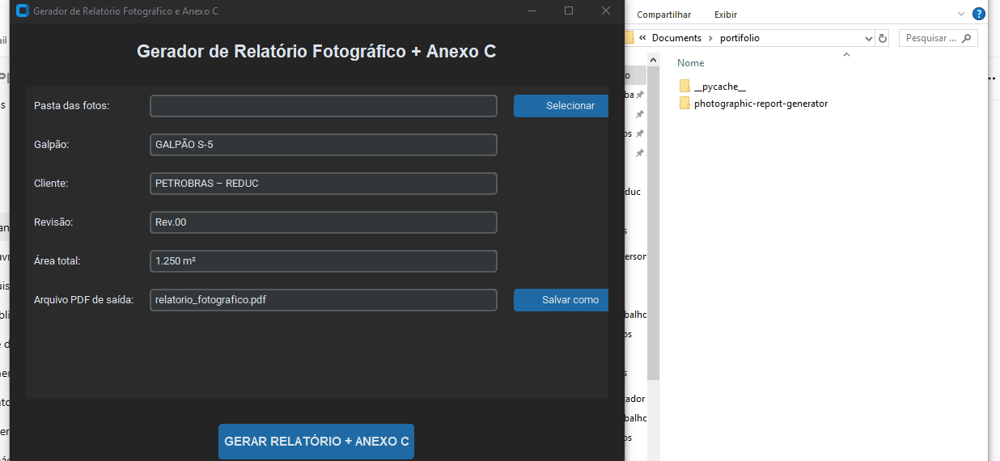
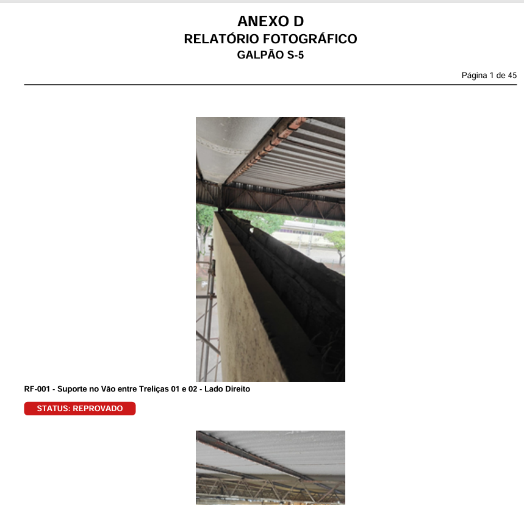
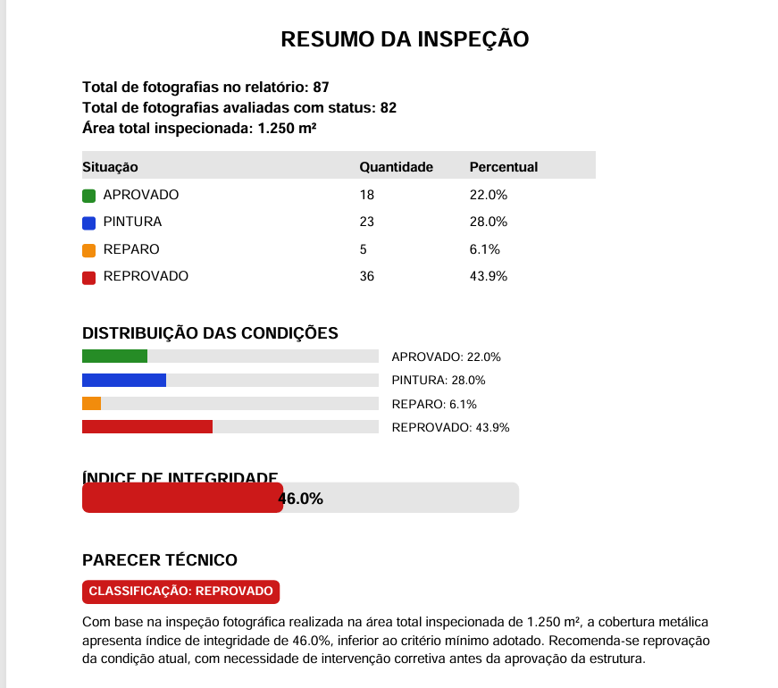
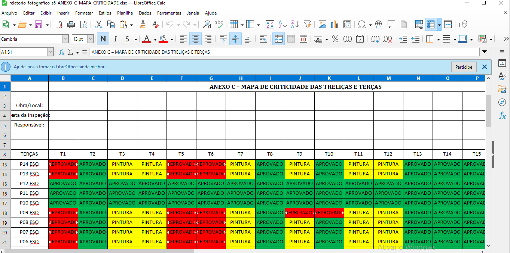
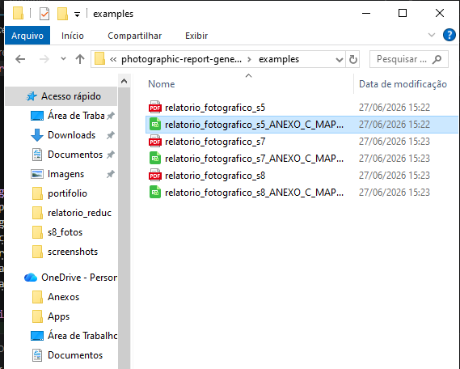

# 📸 Industrial Photo Report Generator

<p align="center">
  
</p>

<p align="center">


</p>

---

## 📖 About

**Industrial Photo Report Generator** is a desktop application developed in **Python** to automate the creation of industrial photographic inspection reports.

The application allows inspectors and engineers to organize inspection photos, generate professional PDF reports, create Annex C automatically, and standardize documentation for industrial inspections.

---

# ✨ Features

- 📸 Automatic photo organization
- 📄 Professional PDF report generation
- 📑 Automatic Annex C generation
- 🏗 Industrial inspection workflow
- 🖥 Modern CustomTkinter graphical interface
- ⚡ Fast and easy report creation
- 📂 Custom output file selection

---

# 🖥 Interface

<p align="center">

</p>

---

# 📄 Generated Report

<p align="center">

</p>

<p align="center">

</p>

---

# 📊 Criticality Analysis

<p align="center">

</p>

---

# 📤 Application Output

<p align="center">

</p>

---

# 🛠 Technologies

- Python
- CustomTkinter
- ReportLab
- Pillow
- PyPDF2

---

# 📁 Project Structure

```text
industrial-photo-report-generator/
│
├── README.md
├── LICENSE
├── requirements.txt
│
├── docs/
│   └── screenshots/
│
├── examples/
│
├── assets/
│
└── src/
    ├── interface.py
    ├── new_interface.py
    ├── motor_relatorio.py
    └── motor_anexo_c.py
```

---

# 🚀 Installation

Clone the repository:

```bash
git clone https://github.com/andersonrock2496-ops/industrial-photo-report-generator.git
```

Install the dependencies:

```bash
pip install -r requirements.txt
```

Run the application:

```bash
python src/interface.py
```

---

# 🎯 Use Cases

- Industrial Roof Inspection
- Structural Inspection
- Asset Integrity Inspection
- Engineering Documentation
- Maintenance Reports
- Technical Inspections

---

# 👨‍💻 Author

**Anderson Rocha de Oliveira**

- Industrial Inspector
- Python Developer
- Computer Science Student
- Agronomy Student
- Industrial Automation Specialist

GitHub:

https://github.com/andersonrock2496-ops

---

# ⭐ If you found this project useful, consider giving it a Star!